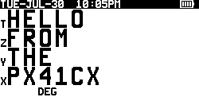

# px41cx-hex2bmp
Python utility to extract hex encoded screenshots from PX41CX serial connection log and save to multiple BMP files
# Installation
This program requires Python 3 and the MicroBMP module which can be found at: https://pypi.org/project/microbmp/
# Usage
```
Usage: px41cx_hex2bmp.py [-h] infile outfile

Extract screenshots from PX41CX terminal log file.

positional arguments:
  infile      log of PX41CX serial connection containing hex encoded screenshots
  outfile     BMP filename prefix, file count will be added as nn

optional arguments:
  -h, --help  show this help message and exit
```
# Examples
```
python px41cx_hex2bmp.py px41cx_log screenshots
screenshots01.bmp
screenshots02.bmp
screenshots03.bmp
screenshots04.bmp
```
# Sample Screenshots

